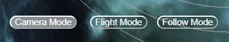

# Tarea 6 IG - Leslie Liu Romero Martín

## Link de CodeSandbox

- https://codesandbox.io/p/sandbox/practica-6-s7l5wp

## Introducción

Para esta tarea de realizar un sistema solar, he decidido hacer una variante en la que se puede identificar la Tierra y el Sol, pero el resto de los planetas son de distintos colores y tamaño para añadir cierta originalidad.

Con respecto a la implementación, partimos del ejemplo de clase para aplicar las luces, sombras, texturas y vistas. Tras ello, se han implementado diversas funcionalidades adicionales.

## Luces

Por la parte de las luces, he decidido implementar solo luz ambiente para que se pueda apreciar el color de los planetas aunque la luz no les esté dando directamente, y una luz puntual en el centro de la escena, "dentro" del sol, para imitar el efecto del sol siendo la única fuente de luz en el sistema planetario.

A continación, podemos ver la implementación de las luces:

```js
// Luz ambiente
const Lamb = new THREE.AmbientLight(0xffe4b5, 0.3);
scene.add(Lamb);

// Luz puntual
const Lpunt = new THREE.PointLight(0xffe4b5, 2.5, 0, 2);
Lpunt.position.set(0, 0, 0);
Lpunt.castShadow = true;
scene.add(Lpunt);
```

Como se puede apreciar, se han retirado todos los controles y asistentes ya que no eran necesarios para la elaboración de esta práctica.

## Sombras

Con respecto a las sombras, también he optado por mantenerme fiel a los ejercicios de ejemplo ya que no se necesitaba de demasiada complejidad. Me he asegurado de que luz puntual genere sombra en los objectos con la tercera línea (castShadow):

```js
const Lpunt = new THREE.PointLight(0xffe4b5, 2.5, 0, 2);
Lpunt.position.set(0, 0, 0);
Lpunt.castShadow = true; // <--
scene.add(Lpunt);
```

Y a su vez, en los respectivos planetas y en la luna, les añadí las configuraciones necesarias para que puedan generar y recibir sombra:

```js
function Planeta(args) {
  // [...]
  planeta.castShadow = true;
  planeta.receiveShadow = true;
  // [...]
}

function Luna(args) {
  // [...]
  luna.receiveShadow = true;
  luna.castShadow = true;
  // [...]
}
```


## Texturas

Para las texturas, nos basamos en el ejemplo de clase para la implementación, sin embargo, en cuanto a variedad de texturas he querido experimentar y añadir una variedad de colores y formas a los distintos planetas. De hecho, como se puede apreciar a simple vista y tal y como comenté en la introducción, aunque la Tierra, la Luna y el Sol están presentes, mi trabajo no representa de manera exacta el Sistema Solar, sino una versión más colorida y con más variedad de planetas.

Estas son las texturas que he decidido utilizar, tanto para los planetas como para el fondo:

```js
// Texturas
const txtSun = new THREE.TextureLoader().load("src/textures/2k_sun.jpg");
const txtMoon = new THREE.TextureLoader().load("src/textures/2k_moon.jpg");
const txtSpace = new THREE.TextureLoader().load(
  "src/textures/galaxy-night-landscape.jpg"
);
const txtVolcanic = new THREE.TextureLoader().load("src/textures/Volcanic.png");
const txtVenusian = new THREE.TextureLoader().load("src/textures/Venusian.png");
const txtEarthDay = new THREE.TextureLoader().load(
  "src/textures/earthmap1k.jpg"
);
const txtEarthSpec = new THREE.TextureLoader().load(
  "src/textures/2k_earth_specular_map.tif"
);
const txtEarthClouds = new THREE.TextureLoader().load(
  "src/textures/2k_earth_clouds.jpg"
);
const txtEarthBump = new THREE.TextureLoader().load(
  "src/textures/earthbump1k.jpg"
);
const txtEarthAlpha = new THREE.TextureLoader().load(
  "src/textures/earthcloudmaptrans_invert.jpg"
);
const txtSwamp = new THREE.TextureLoader().load("src/textures/Swamp.png");
const txtMartian = new THREE.TextureLoader().load("src/textures/Martian.png");
const txtGas1 = new THREE.TextureLoader().load("src/textures/Gaseous1.png");
const txtGas2 = new THREE.TextureLoader().load("src/textures/Gaseous2.png");
const txtGas4 = new THREE.TextureLoader().load("src/textures/Gaseous4.png");
```


Además, no solo se han creado planetas con simples texturas, sino que para el caso especial de la Tierra, se le ha añadido cierto relieve tal y como se indicó en el ejemplo de clase, para darle cierta distinción con respecto al resto, aunque sea sutil.

Esta es la creación de la Tierra, que como se puede observar, contiene más de una textura:

```js
// Tierra
Planeta(
  scene,
  0.4,
  5,
  0.5,
  0xffffff,
  1.0,
  1.2,
  txtEarthDay,
  txtEarthBump,
  txtEarthSpec
);
```


Y esta sería la función Planeta, con todas las opciones para los distintos tipos de texturas siguiendo el ejemplo de clase:

```js
function Planeta(
  parent,
  radio,
  dist,
  vel,
  col,
  f1,
  f2,
  texture = undefined,
  texbump = undefined,
  texspec = undefined,
  texalpha = undefined
) {
  let geom = new THREE.SphereGeometry(radio, 30, 30);
  let mat = new THREE.MeshPhongMaterial({ color: col });
  if (texture != undefined) {
    mat.map = texture;
  }
  // Textura
  if (texture != undefined) {
    mat.map = texture;
  }
  // Rugosidad
  if (texbump != undefined) {
    mat.bumpMap = texbump;
    mat.bumpScale = 1;
  }
  // Especular
  if (texspec != undefined) {
    mat.specularMap = texspec;
    mat.specular = new THREE.Color("orange");
  }
  if (texalpha != undefined) {
    //Con mapa de transparencia
    mat.alphaMap = texalpha;
    mat.transparent = true;
    mat.side = THREE.DoubleSide;
    mat.opacity = 1.0;
  }

  // Más cálculos
  // [...]
}
```

## Planetas

Con respecto a los planetas, tenemos mucha variedad, en orden de más cercano al Sol a más lejano tenemos: planeta estilo volcánico, planeta estilo venusiano, la Tierra, planeta estilo pantanoso (swamp), planeta estilo marciano, planeta gigante gaseoso de tonos

```js
// Volcánico
Planeta(scene, 0.2, 3, 0.4, 0xffffff, 1.0, 1.0, txtVolcanic);
// Venusiano
Planeta(scene, 0.3, 4, 0.3, 0xffffff, 1.0, 1.0, txtVenusian);
// Tierra
Planeta(
  scene,
  0.4,
  5,
  0.5,
  0xffffff,
  1.0,
  1.2,
  txtEarthDay,
  txtEarthBump,
  txtEarthSpec
);
// Luna
Luna(Planetas[2], 0.1, 0.6, 0.4, 0xffffff, Math.PI / 2, txtMoon);
// Swamp
Planeta(scene, 0.45, 7, 0.35, 0xffffff, 1.1, 1.0, txtSwamp);
// Martian
Planeta(scene, 0.3, 9, 0.25, 0xffffff, 1.0, 1.0, txtMartian);
// Gaseoso 1
Planeta(scene, 0.7, 10.5, 0.2, 0xffffff, 1.0, 1.0, txtGas1);
// Gaseoso 2
Planeta(scene, 0.6, 12, 0.22, 0xffffff, 1.0, 1.0, txtGas2);
// Gaseoso 4
Planeta(scene, 0.8, 13.5, 0.15, 0xffffff, 1.0, 1.1, txtGas4);
```

|[Planets](./imgs/planets.png)

## Botones

Acerca de los botones, he declarado algunas funciones para automatizar la creación de los botones y su cambio de aspecto. Tenemos CreateButton, que se encarga de la creación del elemento en el DOM y le añade todas las propiedades necesarias (posición, colores, etc), con esto además nos aprovechamos de los estilos que he creado en el archivo "styles.css" que define la estética de los botones.

Otra función que tenemos es selectButton, que dependiendo de qué grupo de botones estemos pulsando (list → "modes", "speeds") se encarga de seleccionar y deseleccionar (a nivel estético) los botones correspondientes.

```js
function createButton(
  name,
  isActive,
  top = "",
  right = "",
  bottom = "",
  left = "",
  type = ""
) {
  let btn = document.createElement("button");
  btn.innerHTML = name;
  btn.classList.add("btn");
  if (isActive) {
    btn.classList.add("active-btn");
  }
  btn.style.top = top;
  btn.style.bottom = bottom;
  btn.style.left = left;
  btn.style.right = right;
  if (type == "mode") {
    modes.push(btn);
  } else if (type == "speed") {
    speeds.push(btn);
  }
  return btn;
}

function selectButton(button, list) {
  for (let b of list) {
    if (b == button) {
      b.classList.add("active-btn");
    } else {
      b.classList.remove("active-btn");
    }
  }
}
```

Archivo styles.css:

```css
.info {
  position: absolute;
  top: 30px;
  width: 100%;
  text-align: center;
  color: #fff;
  font-weight: bold;
  background-color: transparent;
  z-index: 1;
  font-family: Monospace;
}

.btn {
  position: absolute;
  border-radius: 10px;
  color: rgb(255, 255, 255);
  border-color: rgb(255, 255, 255);
  background-color: transparent;
  z-index: 2;
}

.btn:hover {
  background-color: rgba(255, 255, 255, 0.5);
  cursor: pointer;
}

.active-btn {
  background-color: rgba(255, 255, 255, 0.5);
}
```

Estas funciones luego se llaman en el init() para poder crear los distintos botones para los cambios de modo (camera, flight, follow), los cambios de velocidad (x0.5, x0.1, x1.5) o el botón de pausa. Para cada botón, se le asigna una función de "onclick" que ejecutará una serie de instrucciones al pulsar el botón:

```js
pauseButton = createButton("Pause", false, "30px", "20px"); // <--
pauseButton.onclick = function () {
  if (pauseButton.innerHTML == "Pause") {
    pauseButton.classList.add("active-btn");
    pauseButton.innerHTML = "Paused";
    savedTimestamp = Date.now();
    pause = true;
  } else if (pauseButton.innerHTML == "Paused") {
    pauseButton.classList.remove("active-btn");
    pauseButton.innerHTML = "Pause";
    pause = false;
    offset += Date.now() - savedTimestamp;
  }
};
```


```js
// Botón modo camera
cameraButton = createButton(
  "Camera Mode",
  true,
  "",
  "",
  "30px",
  "30px",
  "mode"
);
cameraButton.onclick = function () {
  selectButton(cameraButton, modes);
  camera.position.set(0, 2, -18);
  camcontrols.target.set(0, 0, 0);
  camcontrols.update();
  camcontrols.enabled = true;
  flyControls.enabled = false;
  mode = 0;
};
document.body.appendChild(cameraButton);

// Botón modo vuelo
flightButton = createButton(
  "Flight Mode",
  false,
  "",
  "",
  "30px",
  "150px",
  "mode"
);
flightButton.onclick = function () {
  selectButton(flightButton, modes);
  camera.position.set(
    estrella.position.x,
    estrella.position.y + 1,
    estrella.position.z - 8
  );
  camcontrols.target.set(0, 0, 0);
  camcontrols.update();
  spaceship.position.set(
    camera.position.x,
    camera.position.y,
    camera.position.z
  );
  camcontrols.enabled = false;
  flyControls.enabled = true;
  mode = 1;
};
document.body.appendChild(flightButton);

// Follow mode
followButton = createButton(
  "Follow Mode",
  false,
  "",
  "",
  "30px",
  "250px",
  "mode"
);
followButton.onclick = function () {
  selectButton(followButton, modes);
  camera.position.set(
    Planetas[2].position.x,
    Planetas[2].position.y - 4,
    Planetas[2].position.z + 2
  );
  mode = 2;
};
document.body.appendChild(followButton);
```



```js
// Speed buttons
speed1 = createButton("x0.5", false, "30px", "", "", "30px", "speed");
speed1.onclick = function () {
  selectButton(speed1, speeds);
  speedConfig = 0.5;
  t0 = Date.now();
};
document.body.appendChild(speed1);
speed2 = createButton("x1.0", true, "30px", "", "", "80px", "speed");
speed2.onclick = function () {
  selectButton(speed2, speeds);
  speedConfig = 1.0;
  t0 = Date.now();
};
document.body.appendChild(speed2);
speed3 = createButton("x1.5", false, "30px", "", "", "130px", "speed");
speed3.onclick = function () {
  selectButton(speed3, speeds);
  speedConfig = 1.5;
  t0 = Date.now();
};
document.body.appendChild(speed3);
```


## Funcionalidades: Pausa

Para la pausa, tras ciertas complicaciones, decidí implementarlo de manera que se calcule un "offset" cuando se pulsa el botón de pausa, este offset servirá como un valor auxiliar que se encarga de eliminar la diferencia desde que se pulsó el botón y los planetas pararon su movimiento, hasta que se vuelve a pulsar y se reanudan las rotaciones. De esta manera a la vista no es perceptible que haya pasado el tiempo. Todos estos cálculos se han tenido que realizar debido a que el movimiento de los planetas es dependiente del tiempo transcurrido desde que se inicializa la variable "t0", que se declara en el init() como cero e indica el comienzo de la ejecución.

El offset se encuentra en la función para el botón de pausa:

```js
pauseButton.onclick = function () {
  if (pauseButton.innerHTML == "Pause") {
    pauseButton.classList.add("active-btn");
    pauseButton.innerHTML = "Paused";
    savedTimestamp = Date.now();
    pause = true;
  } else if (pauseButton.innerHTML == "Paused") {
    pauseButton.classList.remove("active-btn");
    pauseButton.innerHTML = "Pause";
    pause = false;
    offset += Date.now() - savedTimestamp;
  }
};
```

Posteriormente, en el animate, el timestamp que interviene en la rotación de los planetas, se calcula con el offset:

```js
if (!pause) {
  lastTimestamp = timestamp;
  timestamp = (Date.now() - offset - t0) * accglobal;
  timePassed = timestamp - lastTimestamp;
}
```

## Funcionalidades: Modos

Para los modos, hemos establecido los dos modos principales: el de camera, con los controles de ratón (camcontrols) y los controles que se asemejan a la conducción de una nave (flycontrols):

```js
camcontrols = new OrbitControls(camera, renderer.domElement);
camcontrols.enabled = true;
flyControls = new FlyControls(camera, renderer.domElement);
flyControls.enabled = false;
flyControls.dragToLook = true;
flyControls.movementSpeed = 2;
flyControls.rollSpeed = 0.5;
```

Para su funcionamiento, nos encargamos de cambiar la vista de la cámara y habilitar y deshabilitar los modos correspondientes dependiendo del botón pulsado:

```js
cameraButton.onclick = function () {
  selectButton(cameraButton, modes);
  camera.position.set(0, 2, -18); // <-- Cambiar la vista de cámara
  camcontrols.target.set(0, 0, 0); // <-- Resetear la posición inical
  camcontrols.update();
  camcontrols.enabled = true; // <-- Controles de cámara habilitados
  flyControls.enabled = false;
  w;
  mode = 0;
};

// Mismo proceso en los controles de vuelo
flightButton.onclick = function () {
  selectButton(flightButton, modes);
  camera.position.set(
    estrella.position.x,
    estrella.position.y + 1,
    estrella.position.z - 8
  );
  camcontrols.target.set(0, 0, 0);
  camcontrols.update();
  spaceship.position.set(
    camera.position.x,
    camera.position.y,
    camera.position.z
  );
  camcontrols.enabled = false;
  flyControls.enabled = true; // <-- Controles de vuelo habilitados
  mode = 1;
};
```

Con respecto al posicionamiento, he querido ofrecer una vista más abierta para la vista de cámara mientras que la vista de vuelo se encuentra más baja y por detrás del Sol, para que diese mayor sensación de encontrarse en la escena.

Por último, tenemos el modo "follow" que simplemente se encarga de seguuir a la Tierra y siempre observarla, lo que produce un efecto interesante y nos permite ver todo el sistema solar de manera agradable.

```js
followButton.onclick = function () {
  selectButton(followButton, modes);
  camera.position.set(
    Planetas[2].position.x,
    Planetas[2].position.y - 4,
    Planetas[2].position.z + 2
  );
  mode = 2;
};
```

Luego en el animate tenemos que actualizar la posición de la cámara y el lookAt para mantenernos siguiendo la posición de la Tierra:

```js
// Estando en modo = 2 (follow)
camera.position.set(
  Planetas[2].position.x,
  Planetas[2].position.y + 2,
  Planetas[2].position.z - 4
);
camera.lookAt(
  Planetas[2].position.x,
  Planetas[2].position.y,
  Planetas[2].position.z
);
camcontrols.enabled = false;
flyControls.enabled = false;
```

Además, he querido desactivar los controles de la cámara y de vuelo para que no se produzcan problemas al intentar recolocar la cámara.

Modo cámara:


Modo vuelo:


Modo seguimiento:


## Funcionalidades: Velocidades

Como última funcionalidad, he añadido el cambio de velocidad de los planetas cuando utilizamos los respectivos botones. Podemos ponerlos a la velocidad estándar (x1.0), a la mitad (x0.5) o ligeramente más veloz (x1.5).

Funciona a través de la variable speedConfig, que, en el animate(), se multiplica por la velocidad. Además, he añadido la reasignación del valor de t0, para que la posición de los planetas se reinicie cada vez que se cambie de velocidad, de esta manera evitamos los saltos que se producirían con los cambios.

```js
speed1 = createButton("x0.5", false, "30px", "", "", "30px", "speed");
speed1.onclick = function () {
  selectButton(speed1, speeds);
  speedConfig = 0.5;
  t0 = Date.now();
};
document.body.appendChild(speed1);
speed2 = createButton("x1.0", true, "30px", "", "", "80px", "speed");
speed2.onclick = function () {
  selectButton(speed2, speeds);
  speedConfig = 1.0;
  t0 = Date.now();
};
document.body.appendChild(speed2);
speed3 = createButton("x1.5", false, "30px", "", "", "130px", "speed");
speed3.onclick = function () {
  selectButton(speed3, speeds);
  speedConfig = 1.5;
  t0 = Date.now();
};
document.body.appendChild(speed3);
```

El speedConfig en el main para calcular la posición de los planetas:
```js
for (let object of Planetas) {
    object.position.x =
      Math.cos(object.userData.speed * speedConfig * timestamp) *
      object.userData.f1 *
      object.userData.dist;
    object.position.z =
      Math.sin(object.userData.speed * speedConfig * timestamp) *
      object.userData.f2 *
      object.userData.dist;
  }
```

## Añadidos: la nave

Como última nota, faltaría comentar la nave. La decidí añadir para mejorar la perspectiva de vuelo y que diese la sensación de que te encuentras en la nave cuando vuelas, por ello sigue tus movimientos al mover la cámara con los controles de vuelo. La nave como tal se encuentra en un archivo .glb que extraje de la página web sketchfab.com.

El proceso de añadir la nave:
```js
const loader = new GLTFLoader();

// En el init()
loader.load('public/mevak_shuttle.glb',
    function (gltf) {
      spaceship = gltf.scene;
      spaceship.scale.set(0.001, 0.001, 0.001);
      spaceship.position.set(0, -6, 0);
      scene.add(spaceship);
    }
  )

```

Configuración de la posición del nave con respecto a la cámara:
```js
if (mode != 1 && spaceship != undefined) {
    spaceship.position.x = Math.cos(earth.userData.speed * speedConfig * timestamp * (-1.5)) *
    earth.userData.f1 * earth.userData.dist; 
    spaceship.position.z = Math.sin(earth.userData.speed * speedConfig * timestamp * (-1.5)) *
    earth.userData.f1 * earth.userData.dist;
    spaceship.position.y = 3;
}
```

## Créditos
- Nave: https://sketchfab.com/3d-models/mevak-shuttle-24ac6eb2a5734c66bc1804821b6f7beb